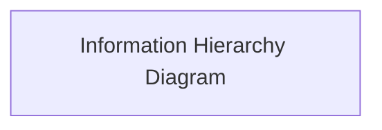
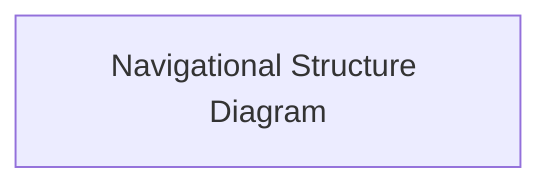
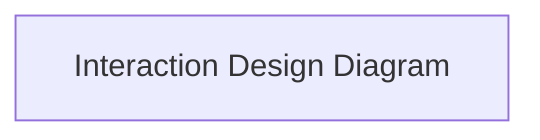
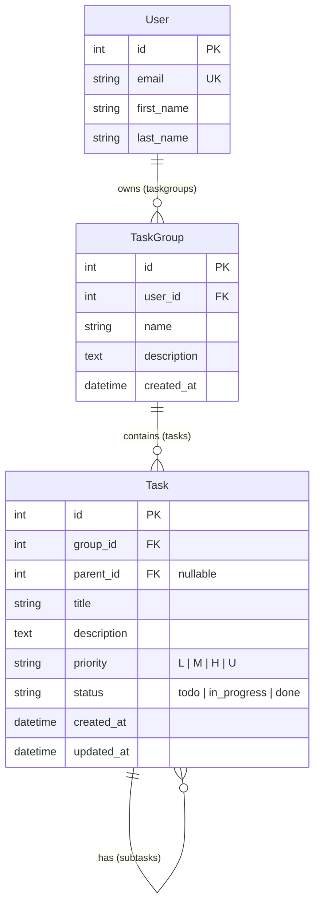

# To Do App

Project overview/introduction.

[View the live site here.](live-link)


## Agile Delivery

## UX

### Strategy

#### Purpose

#### User Needs

#### Business Requirements

### Scope

#### Mapping User Needs to Features

US1: Add a task (must-have)
As a user, I want to add a new task so that I can keep track of things I need to do.

**Tasks:**

Create the Task model; build the add form in the template; handle the POST in task_list view

**Acceptance criteria:**

- A text box and "Add" button are visible on the main page.
- Submitting a title creates the task and it appears in the list.
- The page reloads with the form cleared.

US2: View all tasks (must-have)

As a user, I want to see all my tasks on one page so that I know what's outstanding.

**Tasks:**

Write the task_list view; create the task_list.html template; loop over tasks with .

**Acceptance criteria:**

- All saved tasks are displayed when I open the home page.
- Each task shows its title.
- Tasks are still there after refreshing the page or restarting the server.

US3: Mark a task as complete (must-have)

As a user, I want to mark a task as done so that I can see my progress.

**Tasks:** 

Add the completed field; write the toggle_task view and URL; add the "Done" link.

**Acceptance criteria:**

- Clicking "Done" marks the task complete.
- Completed tasks appear with a strikethrough.
- The change is saved in the database.

US4: Undo a completed task (should-have)

As a user, I want to mark a completed task as not done so that I can fix mistakes.

**Tasks:** 

Reuse the toggle view; show "Undo" when a task is complete.

**Acceptance criteria:**

- Completed tasks show an "Undo" link instead of "Done".
- Clicking it removes the strikethrough and marks the task incomplete.

US5: Delete a task (must-have)

As a user, I want to delete a task so that my list doesn't fill up with things I no longer need.

**Tasks:**

Write the delete_task view and URL; add the "Delete" link.

**Acceptance criteria:**

- Clicking "Delete" removes the task from the list and the database.
- Other tasks are not affected.
- Deleting a task that doesn't exist shows a 404 page rather than crashing.

US6: See a message when the list is empty (should-have)

As a new user, I want to see a friendly message when I have no tasks so that I know the app is working.

**Tasks:** add the  block to the template.

**Acceptance criteria:**

- "No tasks yet!" shows when there are zero tasks.
- The message disappears once a task is added.
- Extension stories

US7: Prevent empty tasks (should-have)

As a user, I want the app to reject blank tasks so that my list stays meaningful.

**Tasks:** keep the required attribute on the input; add a server-side check that strips whitespace; optionally show an error message.

**Acceptance criteria:**

- A task made up only of spaces is not saved.
- No blank rows appear in the list.

US8: Edit a task (must-have)

As a user, I want to change a task's title so that I can fix typos or update details.

**Tasks:** write an edit_task view and URL; create an edit template with a pre-filled form; add an "Edit" link.

**Acceptance criteria:**

- Clicking "Edit" opens a form showing the current title.
... (48 lines left)

#### Defining MVP

### Structure

#### Information Architecture



#### Navigation Design



#### Interaction Design



### Skeleton

#### Wireframing

| Page | Mobile | Tablet | Desktop |
| --- | --- | --- | --- |

### Surface

Summary of the design philosophy and aims.

#### Colour

#### Typography

#### Shape & Space

#### Animation & Micro-Interactions

## Architecture

### Project Structure

```
├── manage.py
├── Procfile
├── pyproject.toml                  # Project dependencies and tooling configurations
├── README.md
├── accounts/                       # User-centric functionality: accounts; role based permissions
├── core/                           # Public facing pages and cross-cutting concerns
├── main/                           # Project-level configurations
│   ├── asgi.py/wsgi.py
│   ├── error_handlers.py
│   ├── urls.py
│   └── settings/                   # Environment specific project settings modules    
├── static/
├── task/                           # Task-centric functionality: tasks; sub-tasks; task-related
├── taskgroup/                      # Taskgroup-centric functionality (project? category? etc)
├── templates/
│    ├── base.html
│    ├── error.html                 # Configurable error template for all error pages
│    ├── shell/                     # Partials for composing UI shell (base.html)
│    └── [apps]/                    # Per-app template directories
└── tests/
     └── [apps]/                    # Per-app test suites under centralised tests directory
```

### Database & Model Design

#### Entity Relationships



#### Model Design

#### Role-Based Permissions

| Role | Permissions | Related Django Flag |
| --- | --- | --- |

### Modularity & Data Boundaries

### Security & Authentication

#### Environmental Configuration

#### Global Login Controls

#### CSRF/XSS Safeguards

### Frontend Engineering

#### Efficiency

#### Safety

## Features

| Feature | Appearance | User Value |
| --- | --- | --- |

### Future Features

## Quality Assurance

### CI/CD

### Test Coverage

### Code Validation

### Responsiveness & Compatibility

| Page | Firefox - Mobile | Chrome - Tablet | Edge - Laptop | Safari - Desktop |
| --- | --- | --- | --- | --- |

### Lighthouse Reports

#### Mobile

#### Desktop

### Known Bugs

## Tools & Stack

### Tech Stack

### Development Tooling

### Design Tools

### AI

## Deployment
[View the deployed site on Heroku.](link)

### Heroku
For deployment, this project uses [Heroku](https://www.heroku.com), a platform as a service (PaaS) that enables developers to build, run, and operate applications entirely in the cloud.

Deployment steps are as follows, after account setup:

- Select **New** in the top-right corner of your Heroku Dashboard, and select **Create new app** from the dropdown menu.
- Your app name must be unique, and then choose a region closest to you (EU or USA), then finally, click **Create App**.
- From the new app **Settings**, click **Reveal Config Vars**, and set your environment variables. 

> [!IMPORTANT]  
> Where indicated, it is important to replace these values with your own secure credentials. Never commit your credentials to GitHub.

| Key | Value |
| --- | --- |
| `DATABASE_URL` | **insert-your-own-postgres-database-url** |
| `DJANGO_SETTINGS_MODULE` | main.settings.production |
| `SECRET_KEY` | **insert-your-own-secure-secret-key** |
| `ALLOWED_HOSTS` | **insert-your-own-heroku-app-url** |
| `CSRF_TRUSTED_ORIGINS` | **https://insert-your-own-heroku-app-url** |


In order for the site to work correctly on Heroku, the following files must be present in your project:

- [pyproject.toml](pyproject.toml)
- [Procfile](Procfile)
- [.python-version](.python-version)

This project uses Astral's uv to manage dependencies. If you use uv, initialise the project environment using from **[pyproject.toml](pyproject.toml)** with the following command:

```bash
uv sync

```
This creates a venv, and installs the project dependencies into it.

Alternatively, you can also use pip to install the project's dependencies from **[pyproject.toml](pyproject.toml)** using:

```bash
python3 -m venv .venv           # Create a virtual environment
source .venv/bin/activate       # Activate the venv
pip3 install .                  # Install dependencies into venv
```

If you have your own packages that have been installed, then you should update the project dependencies. So as to maintain consistency and reliability with the existing dependencies, this should be done with uv. If the dependency is a production dependency, you can both install the package, and update the **[pyproject.toml](pyproject.toml)** file with:

```bash
uv add <package_name>

# Or, if the package is a development dependency
uv add --dev <package_name>
```

The **[Procfile](Procfile)** can be created with the following command:

```bash
cat << 'EOF' > Procfile
release: uv run python manage.py migrate --noinput
web: gunicorn main.wsgi
EOF
```
This will ensure that any database migrations are run when the application is deployed, and that Heroku knows how to start your application for production.


The **[.python-version](.python-version)** file tells Heroku the specific version of Python to use when running your application. This file is usually created by uv 

- `3.14`

For Heroku deployment, connect your own GitHub repository to the newly created app:

- Select **Automatic Deployment** from the Heroku app.

The project should now be connected and deployed to Heroku!

---

### PostgreSQL

This project uses a [Code Institute PostgreSQL Database](https://dbs.ci-dbs.net) for the Relational Database with Django.

> [!CAUTION]
> - PostgreSQL databases by Code Institute are only available to CI Students.
> - You must acquire your own PostgreSQL database through some other method if you plan to clone/fork this repository.
> - Code Institute students are allowed a maximum of 8 databases.
> - Databases are subject to deletion after 18 months.

To obtain my own Postgres Database from Code Institute, I followed these steps:

- Submitted my email address to the CI PostgreSQL Database link above.
- An email was sent to me with my new Postgres Database.
- The Database connection string will resemble something like this:
    - `postgres://<db_username>:<db_password>@<db_host_url>/<db_name>`
- You can use the above URL with Django; simply paste it into your `.env` file and Heroku Config Vars as `DATABASE_URL`.

---

### WhiteNoise

This project uses the [WhiteNoise](https://whitenoise.readthedocs.io/en/latest/) to aid with static files temporarily hosted on the live Heroku site.

To include WhiteNoise in your own projects:

- Install the latest WhiteNoise package using your preferred package manager:

**uv:**
```bash
uv add whitenoise
```

***pip:**

```bash
pip install whitenoise
```

- Update the `pyproject.toml` file with the newly installed package:

```bash
pip freeze --local > pyproject.toml
```

- Edit your base settings module by adding WhiteNoise to the `MIDDLEWARE` list, above all other middleware (apart from Django’s "SecurityMiddleware"):

```python
# main/settings/base.py

MIDDLEWARE = [
    'django.middleware.security.SecurityMiddleware',
    'whitenoise.middleware.WhiteNoiseMiddleware',
    # any additional middleware
]
```
---

### Local Development

This project can be cloned or forked in order to make a local copy on your own system.

For either method, you will need to install any applicable packages found within the [pyproject.toml](pyproject.toml) file.

Use your preferred package manager to initialise the project environment.

```bash
uv sync
```

```bash
python3 -m venv .venv           # Create a virtual environment
source .venv/bin/activate       # Activate the venv
pip3 install .                  # Install dependencies into venv
```

To use the project's development tooling, you should also run:

```bash
pre-commit install
```

This will install the pre-commit hooks for the project, which will verify that the commit is not being made on the main branch; run ruff linting and formatting on the Python code; and run djLint linting and formatting on the templates. This ensures a level of consistency and quality control in the codebase, as it verifies the code against these criteria before it can be committed.

#### Environment Variables

 Key | Value |
| --- | --- |
| `DATABASE_URL` | sqlite3 |
| `DJANGO_SETTINGS_MODULE` | main.settings.local |
| `SECRET_KEY` | **insert-your-own-secure-secret-key** |

You should create a .env file in the root of the project and add the above environment variables to it. You can use the .env.example file as a guide. It is important to keep the .env file out of version control, as it contains sensitive information.

The default DEBUG value for the local settings is set to True. If you want to change this, you can temporarily amend the DEBUG value in main.settings.local - or, you can temporarily amend your .env file to `DJANGO_SETTINGS_MODULE=main.settings.testing` or `DJANGO_SETTINGS_MODULE=main.settings.production`. These both have DEBUG set to False. Please note, you may need to restart VS Code for this change to take effect, as VS Code typically loads up environment variables once, on opening.


Once the project is cloned or forked, in order to run it locally, you'll need to follow these steps:

- Start the Django app:

```bash
python3 manage.py runserver
```

- Stop the app once it's loaded: `CTRL+C` (*Windows/Linux*) or `⌘+C` (*Mac*)
- Make any necessary migrations:

```bash
python3 manage.py makemigrations --dry-run
```
```bash
python3 manage.py makemigrations
```

- Migrate the data to the database:

```bash
python3 manage.py migrate --plan
```
```bash
python3 manage.py migrate
```

- Create a superuser:

```bash
python3 manage.py createsuperuser
```

- Everything should be ready now, so run the Django app again:

```bash
python3 manage.py runserver
```

If you'd like to backup your database models, use the following command for each model you'd like to create a fixture for:

```bash
python3 manage.py dumpdata your-model > your-model.json
```
- *repeat this action for each model you wish to backup*
- **NOTE**: You should never make a backup of the default *admin* or *users* data with confidential information.

---

#### Cloning

You can clone the repository by following these steps:

1. Go to the [GitHub repository](https://www.github.com/Zealous242/to-do-app.git).
2. Locate and click on the green "Code" button at the very top, above the commits and files.
3. Select whether you prefer to clone using "HTTPS", "SSH", or "GitHub CLI", and click the "copy" button to copy the URL to your clipboard.
4. Open "Git Bash" or "Terminal".
5. Change the current working directory to the location where you want the cloned directory.
6. In your IDE Terminal, copy and run the following command:

```bash
git clone https://www.github.com/Zealous242/to-do-app.git
```

7. Press "Enter" to create your local clone.

Alternatively, if using Ona (formerly Gitpod), you can click below to create your own workspace using this repository.

[](https://gitpod.io/#https://www.github.com/Zealous242/love-bouldering-2)

**Please Note**: in order to directly open the project in Ona (Gitpod), you should have the browser extension installed. A tutorial on how to do that can be found [here](https://www.gitpod.io/docs/configure/user-settings/browser-extension).

---

#### Forking

By forking the GitHub Repository, you make a copy of the original repository on our GitHub account to view and/or make changes without affecting the original owner's repository. You can fork this repository by using the following steps:

1. Log in to GitHub and locate the [GitHub Repository](https://www.github.com/Zealous242/to-do-app.git).
2. At the top of the Repository, just below the "Settings" button on the menu, locate and click the "Fork" Button.
3. Once clicked, you should now have a copy of the original repository in your own GitHub account!

---

## Credits
