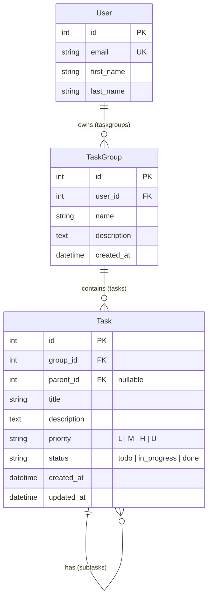

# To Do App

## Introduction

Tend is a calm, distinctive to-do app centred around the idea that small things, tended to regularly, grow over time.

Users organise their tasks around the things they are working on. Completing tasks contributes to the visual growth of that thing, making otherwise invisible progress tangible.

The garden/growth idea is the brand metaphor, not a literal gardening-themed UI. The product language is natural and human, rather than relying on gimmicky garden themed language.

## Live Site Link

[View the live site here:](https://to-do-app-1242-0c9652a17a93.herokuapp.com/)

## Project Board

[View the project board here:](https://github.com/users/Zealous242/projects/12/views/1?pane=issue&itemId=258541256&issue=Zealous242%7Cto-do-app%7C18)

## Device Views


## Overview

The purpose of the website is to provide users with a simple and intuitive task-management system where they can create, view, update, organise, complete, and delete tasks, helping them keep track of outstanding work and monitor their progress. 

he core purpose is to allow users to:

- Add tasks they need to complete.
- View all their tasks in one place.
- Mark tasks as complete and undo completion when necessary.
- Edit tasks when details change.
- Delete tasks that are no longer needed.
- Receive clear feedback and guidance when performing actions.

## User Roles

### User

The **User** is the main user of the application. Their role is to manage and keep track of their tasks.

Users can:

- Add new tasks.
- View all saved tasks.
- Mark tasks as complete.
- Undo completed tasks.
- Edit existing tasks.
- Delete tasks.
- Organise tasks using categories and priorities, where supported.
- Filter tasks by category or priority, where supported.
- Set optional due dates for tasks, where supported.

The User role is focused on helping users manage their tasks and track their progress.

### Admin

The **Admin** is responsible for managing task data through the Django administration panel.

Admins can:

- Log in to the Django admin panel at `/admin/`.
- View tasks.
- Add tasks.
- Edit tasks.
- Delete tasks.
- View each task's title and completion status.

The Admin role is intended to help maintain and manage task data within the application.


## User Stories

### US1: Add a task (must-have)
As a user, I want to add a new task so that I can keep track of things I need to do.

**Tasks:**

Create the Task model; build the add form in the template; handle the POST in task_list view

**Acceptance criteria:**

- A text box and "Add" button are visible on the main page.
- Submitting a title creates the task and it appears in the list.
- The page reloads with the form cleared.

### US2: View all tasks (must-have)

As a user, I want to see all my tasks on one page so that I know what's outstanding.

**Tasks:**

Write the task_list view; create the task_list.html template; loop over tasks with .

**Acceptance criteria:**

- All saved tasks are displayed when I open the home page.
- Each task shows its title.
- Tasks are still there after refreshing the page or restarting the server.

### US3: Mark a task as complete (must-have)

As a user, I want to mark a task as done so that I can see my progress.

**Tasks:** 

Add the completed field; write the toggle_task view and URL; add the "Done" link.

**Acceptance criteria:**

- Clicking "Done" marks the task complete.
- Completed tasks appear with a strikethrough.
- The change is saved in the database.

### US4: Undo a completed task (should-have)

As a user, I want to mark a completed task as not done so that I can fix mistakes.

**Tasks:** 

Reuse the toggle view; show "Undo" when a task is complete.

**Acceptance criteria:**

- Completed tasks show an "Undo" link instead of "Done".
- Clicking it removes the strikethrough and marks the task incomplete.

### US5: Delete a task (must-have)

As a user, I want to delete a task so that my list doesn't fill up with things I no longer need.

**Tasks:**

Write the delete_task view and URL; add the "Delete" link.

**Acceptance criteria:**

- Clicking "Delete" removes the task from the list and the database.
- Other tasks are not affected.
- Deleting a task that doesn't exist shows a 404 page rather than crashing.

### US6: See a message when the list is empty (should-have)

As a new user, I want to see a friendly message when I have no tasks so that I know the app is working.

**Tasks:** add the  block to the template.

**Acceptance criteria:**

- "No tasks yet!" shows when there are zero tasks.
- The message disappears once a task is added.
- Extension stories

### US7: Prevent empty tasks (should-have)

As a user, I want the app to reject blank tasks so that my list stays meaningful.

**Tasks:** keep the required attribute on the input; add a server-side check that strips whitespace; optionally show an error message.

**Acceptance criteria:**

- A task made up only of spaces is not saved.
- No blank rows appear in the list.

### US8: Edit a task (must-have)

As a user, I want to change a task's title so that I can fix typos or update details.

**Tasks:** write an edit_task view and URL; create an edit template with a pre-filled form; add an "Edit" link.

**Acceptance criteria:**

### US9: See newest and incomplete tasks first (should-have)

As a user, I want unfinished tasks at the top so that I can focus on what's left.

**Tasks:** order the queryset by completed, then -created_at.

**Acceptance criteria:**

- Incomplete tasks always appear above completed ones.
- Within each group, the newest task is first.


### US10: Set a due date (could-have)

As a user, I want to give a task a due date so that I know what's urgent.

**Tasks:** add a due_date field to the model; run migrations; add a date input to the form; display the date in the list.

**Acceptance criteria:**

- The due date is optional.
- A task with a due date shows it next to the title.
- Overdue incomplete tasks are visibly highlighted (e.g. red text).

### US11: Manage tasks through the admin panel (could-have)

As an admin, I want to manage tasks from Django's admin site so that I can fix or clean up data easily.

**Tasks:** register Task in admin.py; create a superuser; set list_display to show title and completed status.

**Acceptance criteria:**

- I can log in at /admin/.
- I can view, add, edit, and delete tasks there.
- The list shows each task's title and status.

### US12: Use the app on a phone (could-have)

As a user, I want the list to look good on a small screen so that I can use it anywhere.

**Tasks:** add the viewport meta tag; use flexible widths in the CSS; test using browser dev tools.

**Acceptance criteria:**

No horizontal scrolling on a 375px-wide screen.
Buttons and links are big enough to tap.

### US13: Categorise Tasks (could-have)

As a user, I want to assign categories to my tasks, so that I can organise different types of tasks.

**Tasks:**

- Assign a category

- Change a category

- Save/display the category

**Acceptance criteria:**

- User can assign a category when creating a task

- User can change the category when editing a task

- Selected category is saved

- Category is displayed with the task

### US14: Filter Options (could-have)

As a user, I want to filter my tasks by category, so that I can focus on a particular group of tasks.

**Tasks:**

- Filter by category

- Filter by priority

- Return to all tasks

**Acceptance criteria:**

- User can select a category

- Only tasks belonging to the selected category are displayed

- User can return to viewing all tasks

### US15: Prioritise Tasks (could-have)

As a user, I want to assign and organise tasks by priority, so that I can focus on the most important tasks first.

**Tasks:**

- Define priority levels such as High, Medium and Low

- Add priority field to the Task model

- Add priority selection to create and edit forms

- Display task priority

**Acceptance criteria:**

- User can assign a priority when creating a task

- User can change the priority when editing a task

- Priority is saved with the task

- Priority is clearly displayed

### US16: Intuitive Navigation (must-have)

As a user, I want the application to be simple and intuitive to navigate, so that I can quickly add, view, edit and delete my tasks.

**Tasks:**

- Create consistent site navigation

- Provide clear navigation to task management features

- Add clear navigation back to task list

- Ensure navigation links and buttons are clearly labelled

**Acceptance criteria:**

- User can easily access the task list

- User can easily access the Add Task page

- Edit and delete controls are clearly identifiable

- User can return to the task list after creating or editing a task

### US17: Clear Guidance and Feedback (must-have)

As a user, I want clear guidance and feedback when using the application, so that I know what information to enter and whether my actions have been successful.

**Tasks:**

- Add helpful labels, placeholders or help text to input fields

- Add warning and error messages where appropriate

- Add confirmation messages after successful actions

- Make messages clear and easy to understand

- Ensure messages are displayed consistently throughout the application

**Acceptance criteria:**

- Input fields clearly indicate what information the user should enter

- Required fields are clearly identified

- A clear warning or error message is displayed when appropriate

- Confirmation messages are displayed after successful actions

- Messages clearly explain what has happened

- Messages are displayed consistently across the application

- Messages are easy to notice and understand

## Minimum Viable Product (MVP)

The Minimum Viable Product (MVP) will be the simplest usable version of the task-management application that delivers the core functionality needed for a user to manage their tasks.

The MVP will focus on the must-have user stories, while leaving the should-have and could-have features for later iterations. The user stories identify adding, viewing, completing, deleting, and editing tasks as core functionality.

### MVP Features

The MVP will include:

Add a task – Users can enter a task title and add it to their task list.
View tasks – Users can see all saved tasks on the main page.
Mark a task as complete – Users can mark unfinished tasks as completed.
Edit a task – Users can change the title of an existing task.
Delete a task – Users can remove tasks they no longer need.
Simple navigation – Users can easily access the task list and task-management functionality.
Clear guidance and feedback – Users receive clear information about what to enter and whether an action has been successful.

### MVP Exclusions

The following features will not be required for the initial MVP because they are identified as should-have or could-have functionality:

Undoing completed tasks.
Preventing blank tasks.
Task ordering.
Due dates.
Categories.
Filtering.
Task priorities.
Django admin management.
Mobile-specific optimisation.

### MVP Goal

The goal of the MVP is to provide a working and usable task-management application where a user can create tasks, see their tasks, update them, mark them as complete, and remove them. Once this core functionality is working reliably, the additional features can be developed incrementally through later Agile iterations.

### MVP User Story Priorities

| Priority | User Stories |
| --- | --- |
| **Critical** | US1, US2, US3, US5, US8, US16, US17  |
| **High** | US4, US6, US7, US9 |
| **Medium** | US10, US11, US12, US13, US14, US15 |

For the MVP, the focus should be on the Must Have stories. The Should Have stories can be implemented after the core application is functional, while the Could Have stories can be considered for later development if time and resources allow. This follows the priority classifications already given in the user stories.

## Agile Delivery

The project will follow an Agile approach, delivering the application incrementally through a series of small development iterations. Each iteration will focus on implementing, testing, and reviewing a group of user stories before moving on to the next set of features.

The project began with  17 core user stories. GitHub Proejcts was used to keep user stories organised. 


### Agile Cycle

For each iteration, the development process can follow this cycle:

1. **Plan** – Select the highest-priority user stories for the iteration.
2. **Develop** – Implement the functionality described by the selected stories.
3. **Test** – Test the functionality against its acceptance criteria.
4. **Review** – Check the completed functionality and identify improvements.
5. **Refine** – Update the backlog based on feedback and continue with the next iteration.

This approach allows the core application to become usable early while leaving additional functionality to later iterations. It also provides opportunities to identify problems and improve the application throughout development rather than waiting until the end of the project.

### Product Backlog

The user stories will form the project's product backlog. They will be prioritised according to their importance to the application:

Must-have: Essential functionality required for the core application, such as adding, viewing, completing, editing and deleting tasks.
Should-have: Important improvements that enhance the user experience, such as undoing completed tasks, preventing blank tasks, task ordering and clear feedback.
Could-have: Additional features that can be developed if time and resources allow, such as due dates, categories, filtering, priorities, mobile optimisation and admin functionality.

## UX Design - Strategy Plane

The **strategy plane** defines the overall purpose of the website and what it needs to achieve for its users. For this task-management project, the strategy is centred on providing a simple, intuitive application that allows users to manage their tasks efficiently.

### User Needs

The application should meet the following user needs:

- Users need to **create tasks** so they can keep track of things they need to do.
- Users need to **view their tasks in one place** so they know what is outstanding.
- Users need to **mark tasks as complete** so they can monitor their progress.
- Users need to **edit tasks** when information changes or mistakes need correcting.
- Users need to **delete tasks** that are no longer required.
- Users need **simple and intuitive navigation** so they can quickly access task-management features.
- Users need **clear guidance and feedback** so they understand what information to enter and whether their actions have been successful.

### Business/Product Goals

The project aims to:

1. **Deliver a functional task-management application** with the essential features required by users.
2. **Keep the interface simple and intuitive**, allowing users to manage tasks without unnecessary complexity.
3. **Prioritise core functionality first**, using the Must Have user stories as the foundation of the MVP.
4. **Provide a foundation for future development**, allowing additional features such as due dates, categories, filtering and priorities to be added later.
5. **Ensure task information is persistent**, so saved tasks remain available after refreshing the page or restarting the server.

### Strategy Summary

The strategy is to **build a simple and reliable core task-management system first**, focusing on the Must Have requirements. Once this foundation is working, Should Have and Could Have features can be introduced incrementally through the Agile delivery process.

This approach ensures that the project delivers a useful product early while providing scope for future improvements and additional task-management functionality.

## UX Design - Scope Plane

The scope plane defines the features and functionality that will be included in the task-management application. The scope is based on the project's user stories and their priorities.

### Core Functionality

The initial scope of the project will include the following Must Have functionality:

- Add tasks – Users can create a new task by entering a title.
- View tasks – Users can view all saved tasks on the main page.
- Mark tasks as complete – Users can mark tasks as completed, with completed tasks visually - distinguished.
- Edit tasks – Users can change the title of an existing task.
- Delete tasks – Users can remove tasks that are no longer required.
- Intuitive navigation – Users can easily access the task list and task-management features.
- Clear guidance and feedback – The application provides clear instructions, warnings, errors and confirmation messages.
- Additional Scope

The project also identifies several Should Have features that can extend the core application:

- Undo completed tasks.
- Display a message when there are no tasks.
- Prevent blank tasks from being saved.
- Display incomplete and newest tasks first.

The Could Have features provide further opportunities to extend the application:

- Set optional due dates.
- Manage tasks through the Django admin panel.
- Optimise the application for mobile devices.
- Categorise tasks.
- Filter tasks by category or priority.
- Assign priorities such as High, Medium and Low.

## UX Design - Structure

The **structure plane** defines how the information and functionality of the task-management application will be organised so that users can easily understand and navigate the website. The structure is based on the application's task-management features, navigation requirements, and user interactions.

### Main Application Structure

The application will be organised around a central **Task List**. This will act as the main page where users can see and manage their tasks.

```text
Task Management Application
│
├── Task List / Home
│   ├── Add Task
│   ├── View Tasks
│   ├── Complete / Undo Task
│   ├── Edit Task
│   └── Delete Task
│
├── Add Task
│   └── Task Form
│
├── Edit Task
│   └── Pre-filled Task Form
│
└── Admin
    └── Django Admin Panel
```

### Task List

The **Task List** will be the central area of the application. Users will be able to:

- View all saved tasks.
- See each task's title.
- Add a new task.
- Mark tasks as complete.
- Edit existing tasks.
- Delete tasks.

Completed tasks will be visually distinguished using a strikethrough.

If there are no tasks, the application can display a **"No tasks yet!"** message to provide feedback to the user.

### Add Task

The **Add Task** functionality will provide a form where users can enter a task title. The form will contain a text box and an **Add** button. Once submitted, the new task will appear in the task list.

### Edit Task

The **Edit Task** functionality will provide a form containing the existing task information. Users can change the task title and save their changes. The application will provide navigation back to the task list after editing.

### Task Actions

Each task will have clearly identifiable controls for managing it:

- **Done** – Mark an incomplete task as complete.
- **Undo** – Return a completed task to an incomplete state.
- **Edit** – Change the task information.
- **Delete** – Remove the task.

The exact controls displayed can depend on the task's current state; for example, a completed task displays **Undo** instead of **Done**.

### Future Structure

Additional functionality can be incorporated into the structure as the project develops. This could include:

- **Due dates** displayed alongside task titles.
- **Categories** assigned to tasks.
- **Priority levels** such as High, Medium and Low.
- **Filtering** by category or priority.
- **Mobile-friendly layouts** for smaller screens.
- **Admin functionality** through Django's administration panel.

### Navigation Structure

Navigation will remain consistent throughout the application. Users should be able to:

1. Access the main task list.
2. Navigate to the Add Task page.
3. Edit or delete tasks from the task list.
4. Return to the task list after adding or editing a task.

Links and buttons should have clear labels so users understand where each action will take them. 

## UX Design - Skeleton Plane

The skeleton plane defines the layout and placement of the application's interface elements. It focuses on how users will interact with the features identified in the structure plane, including the placement of navigation, forms, task information, and controls. 

### Wireframes

| Homepage | Edit Task | Create New Task |
| --- | --- | --- | 
|  |  |  | 

| Login | Registration | 
| --- | --- | 
|  |  |

### Navigation

The navigation area should provide clear access to the main parts of the application:

- **Task List** – returns the user to the main task list.
- **Add Task** – allows the user to create a new task.

Navigation should remain consistent throughout the application, allowing users to easily return to the task list after creating or editing a task. This supports the requirement for simple and intuitive navigation.

### Task List

The task list will display the user's saved tasks in a clear and readable format.

Each task should contain:

- The **task title**.
- A **Done** or **Undo** control depending on its completion status.
- An **Edit** control.
- A **Delete** control.

Completed tasks should be visually distinguished using a **strikethrough**, making the user's progress easy to identify.

### Add Task Form

The add-task form should be positioned prominently on the main page or accessed through the Add Task page.

It will contain:

- A text input for the task title.
- An **Add** button.

After a task is submitted, the form should be cleared and the new task should appear in the task list.

### Edit Task Form

The edit interface should contain a pre-filled form displaying the current task title. The user can modify the title and submit the changes.

The interface should provide a clear way to return to the task list after editing.

### Feedback and Messages

The interface should provide visible feedback to help users understand what is happening.

Examples include:

- Confirmation messages after successfully adding, editing, completing or deleting a task.
- Clear error or warning messages when an action cannot be completed.
- Helpful labels or placeholder text explaining what users should enter.
- A **"No tasks yet!"** message when the task list is empty.

## UX Design - Surface Plane

The **surface plane** defines the visual design of the application and how the interface looks and feels to the user. For this task-management project, the visual design should support a simple, clear and easy-to-use task-management experience.

| Dark Theme | Light Theme |
| --- | --- |
|  |  |

### Visual Design

The application should have a **simple, clean and uncluttered** visual appearance. The interface should include:

- Clear and readable typography.
- Consistent spacing between interface elements.
- Consistent styling for buttons and links.
- Important actions that are easy to identify.
- Clear visual differences between incomplete and completed tasks.

### Task Display

Tasks should be displayed clearly so users can quickly understand their current status and available actions.

Each task should provide:

- The task title.
- A **Done** button for incomplete tasks.
- An **Undo** button for completed tasks.
- An **Edit** link or button.
- A **Delete** link or button.
- A strikethrough style for completed tasks.

### Forms

The add and edit forms should be visually clear and easy to use.

The forms should include:

- Clear labels for input fields.
- Clearly visible text input fields.
- An **Add** button for creating a task.
- A clear way to save changes when editing a task.
- Helpful guidance or placeholders where appropriate.
- Clear indication of required information.

### Feedback and Status

The interface should provide clear feedback so users understand what has happened after an action.

Feedback should include:

- Confirmation messages after successful actions.
- Warning or error messages when an action cannot be completed.
- Clear guidance about what information the user should enter.
- A visible completed status for finished tasks.
- An empty-state message, **"No tasks yet!"**, when there are no saved tasks.

### Responsive Design

If the mobile functionality is implemented, the interface should adapt to smaller screen sizes. In particular:

- The layout should work within a 375px viewport.
- The interface should not require horizontal scrolling.
- Widths should be flexible.
- Buttons and other interactive elements should be large enough to tap easily.


### Overall Surface Design

The overall visual design should remain **clear, consistent and easy to use**. The interface should make task information and actions easy to understand while avoiding unnecessary visual complexity.

#### Colour

#### Typography

#### Shape & Space

#### Animation & Micro-Interactions

## Architecture

### Project Structure

```
├── manage.py
├── Procfile
├── pyproject.toml                  # Project dependencies and tooling configurations
├── README.md
├── accounts/                       # User-centric functionality: accounts; role based permissions
├── core/                           # Public facing pages and cross-cutting concerns
├── main/                           # Project-level configurations
│   ├── asgi.py/wsgi.py
│   ├── error_handlers.py
│   ├── urls.py
│   └── settings/                   # Environment specific project settings modules    
├── static/
├── task/                           # Task-centric functionality: tasks; sub-tasks; task-related
├── taskgroup/                      # Taskgroup-centric functionality (project? category? etc)
├── templates/
│    ├── base.html
│    ├── error.html                 # Configurable error template for all error pages
│    ├── shell/                     # Partials for composing UI shell (base.html)
│    └── [apps]/                    # Per-app template directories
└── tests/
     └── [apps]/                    # Per-app test suites under centralised tests directory
```

### Database & Model Design

#### Entity Relationships



#### Model Design

#### Role-Based Permissions

| Role | Permissions | Related Django Flag |
| --- | --- | --- |

### Modularity & Data Boundaries

### Security & Authentication

#### Environmental Configuration

#### Global Login Controls

#### CSRF/XSS Safeguards

### Frontend Engineering

#### Efficiency

#### Safety

## Features

| Feature | Appearance | User Value |
| --- | --- | --- |

### Future Features

## Quality Assurance

### CI/CD

### Test Coverage

### Code Validation

### Responsiveness & Compatibility

| Page | Firefox - Mobile | Chrome - Tablet | Edge - Laptop | Safari - Desktop |
| --- | --- | --- | --- | --- |

### Lighthouse Reports

#### Mobile

#### Desktop

### Known Bugs

## Tools & Stack

### Tech Stack

### Development Tooling

### Design Tools

### AI

## Deployment
[View the deployed site on Heroku.](link)

### Heroku
For deployment, this project uses [Heroku](https://www.heroku.com), a platform as a service (PaaS) that enables developers to build, run, and operate applications entirely in the cloud.

Deployment steps are as follows, after account setup:

- Select **New** in the top-right corner of your Heroku Dashboard, and select **Create new app** from the dropdown menu.
- Your app name must be unique, and then choose a region closest to you (EU or USA), then finally, click **Create App**.
- From the new app **Settings**, click **Reveal Config Vars**, and set your environment variables. 

> [!IMPORTANT]  
> Where indicated, it is important to replace these values with your own secure credentials. Never commit your credentials to GitHub.

| Key | Value |
| --- | --- |
| `DATABASE_URL` | **insert-your-own-postgres-database-url** |
| `DJANGO_SETTINGS_MODULE` | main.settings.production |
| `SECRET_KEY` | **insert-your-own-secure-secret-key** |
| `ALLOWED_HOSTS` | **insert-your-own-heroku-app-url** |
| `CSRF_TRUSTED_ORIGINS` | **https://insert-your-own-heroku-app-url** |


In order for the site to work correctly on Heroku, the following files must be present in your project:

- [pyproject.toml](pyproject.toml)
- [Procfile](Procfile)
- [.python-version](.python-version)

This project uses Astral's uv to manage dependencies. If you use uv, initialise the project environment using from **[pyproject.toml](pyproject.toml)** with the following command:

```bash
uv sync

```
This creates a venv, and installs the project dependencies into it.

Alternatively, you can also use pip to install the project's dependencies from **[pyproject.toml](pyproject.toml)** using:

```bash
python3 -m venv .venv           # Create a virtual environment
source .venv/bin/activate       # Activate the venv
pip3 install .                  # Install dependencies into venv
```

If you have your own packages that have been installed, then you should update the project dependencies. So as to maintain consistency and reliability with the existing dependencies, this should be done with uv. If the dependency is a production dependency, you can both install the package, and update the **[pyproject.toml](pyproject.toml)** file with:

```bash
uv add <package_name>

# Or, if the package is a development dependency
uv add --dev <package_name>
```

The **[Procfile](Procfile)** can be created with the following command:

```bash
cat << 'EOF' > Procfile
release: uv run python manage.py migrate --noinput
web: gunicorn main.wsgi
EOF
```
This will ensure that any database migrations are run when the application is deployed, and that Heroku knows how to start your application for production.


The **[.python-version](.python-version)** file tells Heroku the specific version of Python to use when running your application. This file is usually created by uv 

- `3.14`

For Heroku deployment, connect your own GitHub repository to the newly created app:

- Select **Automatic Deployment** from the Heroku app.

The project should now be connected and deployed to Heroku!

---

### PostgreSQL

This project uses a [Code Institute PostgreSQL Database](https://dbs.ci-dbs.net) for the Relational Database with Django.

> [!CAUTION]
> - PostgreSQL databases by Code Institute are only available to CI Students.
> - You must acquire your own PostgreSQL database through some other method if you plan to clone/fork this repository.
> - Code Institute students are allowed a maximum of 8 databases.
> - Databases are subject to deletion after 18 months.

To obtain my own Postgres Database from Code Institute, I followed these steps:

- Submitted my email address to the CI PostgreSQL Database link above.
- An email was sent to me with my new Postgres Database.
- The Database connection string will resemble something like this:
    - `postgres://<db_username>:<db_password>@<db_host_url>/<db_name>`
- You can use the above URL with Django; simply paste it into your `.env` file and Heroku Config Vars as `DATABASE_URL`.

---

### WhiteNoise

This project uses the [WhiteNoise](https://whitenoise.readthedocs.io/en/latest/) to aid with static files temporarily hosted on the live Heroku site.

To include WhiteNoise in your own projects:

- Install the latest WhiteNoise package using your preferred package manager:

**uv:**
```bash
uv add whitenoise
```

***pip:**

```bash
pip install whitenoise
```

- Update the `pyproject.toml` file with the newly installed package:

```bash
pip freeze --local > pyproject.toml
```

- Edit your base settings module by adding WhiteNoise to the `MIDDLEWARE` list, above all other middleware (apart from Django’s "SecurityMiddleware"):

```python
# main/settings/base.py

MIDDLEWARE = [
    'django.middleware.security.SecurityMiddleware',
    'whitenoise.middleware.WhiteNoiseMiddleware',
    # any additional middleware
]
```
---

### Local Development

This project can be cloned or forked in order to make a local copy on your own system.

For either method, you will need to install any applicable packages found within the [pyproject.toml](pyproject.toml) file.

Use your preferred package manager to initialise the project environment.

```bash
uv sync
```

```bash
python3 -m venv .venv           # Create a virtual environment
source .venv/bin/activate       # Activate the venv
pip3 install .                  # Install dependencies into venv
```

To use the project's development tooling, you should also run:

```bash
pre-commit install
```

This will install the pre-commit hooks for the project, which will verify that the commit is not being made on the main branch; run ruff linting and formatting on the Python code; and run djLint linting and formatting on the templates. This ensures a level of consistency and quality control in the codebase, as it verifies the code against these criteria before it can be committed.

#### Environment Variables

 Key | Value |
| --- | --- |
| `DATABASE_URL` | sqlite3 |
| `DJANGO_SETTINGS_MODULE` | main.settings.local |
| `SECRET_KEY` | **insert-your-own-secure-secret-key** |

You should create a .env file in the root of the project and add the above environment variables to it. You can use the .env.example file as a guide. It is important to keep the .env file out of version control, as it contains sensitive information.

The default DEBUG value for the local settings is set to True. If you want to change this, you can temporarily amend the DEBUG value in main.settings.local - or, you can temporarily amend your .env file to `DJANGO_SETTINGS_MODULE=main.settings.testing` or `DJANGO_SETTINGS_MODULE=main.settings.production`. These both have DEBUG set to False. Please note, you may need to restart VS Code for this change to take effect, as VS Code typically loads up environment variables once, on opening.


Once the project is cloned or forked, in order to run it locally, you'll need to follow these steps:

- Start the Django app:

```bash
python3 manage.py runserver
```

- Stop the app once it's loaded: `CTRL+C` (*Windows/Linux*) or `⌘+C` (*Mac*)
- Make any necessary migrations:

```bash
python3 manage.py makemigrations --dry-run
```
```bash
python3 manage.py makemigrations
```

- Migrate the data to the database:

```bash
python3 manage.py migrate --plan
```
```bash
python3 manage.py migrate
```

- Create a superuser:

```bash
python3 manage.py createsuperuser
```

- Everything should be ready now, so run the Django app again:

```bash
python3 manage.py runserver
```

If you'd like to backup your database models, use the following command for each model you'd like to create a fixture for:

```bash
python3 manage.py dumpdata your-model > your-model.json
```
- *repeat this action for each model you wish to backup*
- **NOTE**: You should never make a backup of the default *admin* or *users* data with confidential information.

---

#### Cloning

You can clone the repository by following these steps:

1. Go to the [GitHub repository](https://www.github.com/Zealous242/to-do-app.git).
2. Locate and click on the green "Code" button at the very top, above the commits and files.
3. Select whether you prefer to clone using "HTTPS", "SSH", or "GitHub CLI", and click the "copy" button to copy the URL to your clipboard.
4. Open "Git Bash" or "Terminal".
5. Change the current working directory to the location where you want the cloned directory.
6. In your IDE Terminal, copy and run the following command:

```bash
git clone https://www.github.com/Zealous242/to-do-app.git
```

7. Press "Enter" to create your local clone.

Alternatively, if using Ona (formerly Gitpod), you can click below to create your own workspace using this repository.

[](https://gitpod.io/#https://www.github.com/Zealous242/love-bouldering-2)

**Please Note**: in order to directly open the project in Ona (Gitpod), you should have the browser extension installed. A tutorial on how to do that can be found [here](https://www.gitpod.io/docs/configure/user-settings/browser-extension).

---

#### Forking

By forking the GitHub Repository, you make a copy of the original repository on our GitHub account to view and/or make changes without affecting the original owner's repository. You can fork this repository by using the following steps:

1. Log in to GitHub and locate the [GitHub Repository](https://www.github.com/Zealous242/to-do-app.git).
2. At the top of the Repository, just below the "Settings" button on the menu, locate and click the "Fork" Button.
3. Once clicked, you should now have a copy of the original repository in your own GitHub account!

---

## Credits
