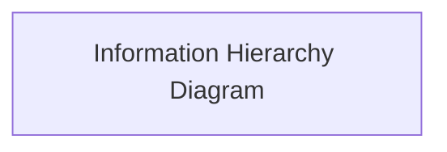
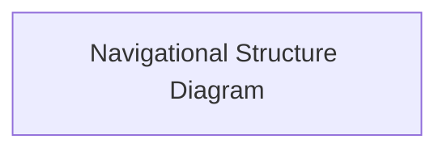
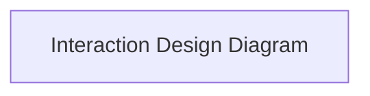
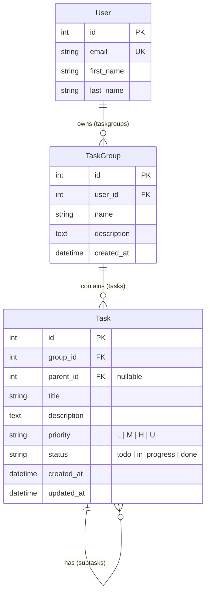

# To Do App

Project overview/introduction.

[View the live site here.](live-link)

## Agile Delivery

## UX

### Strategy

#### Purpose

#### User Needs

#### Business Requirements

### Scope

#### Mapping User Needs to Features

US1: Add a task (must-have)
As a user, I want to add a new task so that I can keep track of things I need to do.

**Tasks:**

Create the Task model; build the add form in the template; handle the POST in task_list view

**Acceptance criteria:**

- A text box and "Add" button are visible on the main page.
- Submitting a title creates the task and it appears in the list.
- The page reloads with the form cleared.

US2: View all tasks (must-have)

As a user, I want to see all my tasks on one page so that I know what's outstanding.

**Tasks:**

Write the task_list view; create the task_list.html template; loop over tasks with .

**Acceptance criteria:**

- All saved tasks are displayed when I open the home page.
- Each task shows its title.
- Tasks are still there after refreshing the page or restarting the server.

US3: Mark a task as complete (must-have)

As a user, I want to mark a task as done so that I can see my progress.

**Tasks:** 

Add the completed field; write the toggle_task view and URL; add the "Done" link.

**Acceptance criteria:**

- Clicking "Done" marks the task complete.
- Completed tasks appear with a strikethrough.
- The change is saved in the database.

US4: Undo a completed task (should-have)

As a user, I want to mark a completed task as not done so that I can fix mistakes.

**Tasks:** 

Reuse the toggle view; show "Undo" when a task is complete.

**Acceptance criteria:**

- Completed tasks show an "Undo" link instead of "Done".
- Clicking it removes the strikethrough and marks the task incomplete.

US5: Delete a task (must-have)

As a user, I want to delete a task so that my list doesn't fill up with things I no longer need.

**Tasks:**

Write the delete_task view and URL; add the "Delete" link.

**Acceptance criteria:**

- Clicking "Delete" removes the task from the list and the database.
- Other tasks are not affected.
- Deleting a task that doesn't exist shows a 404 page rather than crashing.

US6: See a message when the list is empty (should-have)

As a new user, I want to see a friendly message when I have no tasks so that I know the app is working.

**Tasks:** add the  block to the template.

**Acceptance criteria:**

- "No tasks yet!" shows when there are zero tasks.
- The message disappears once a task is added.
- Extension stories

US7: Prevent empty tasks (should-have)

As a user, I want the app to reject blank tasks so that my list stays meaningful.

**Tasks:** keep the required attribute on the input; add a server-side check that strips whitespace; optionally show an error message.

**Acceptance criteria:**

- A task made up only of spaces is not saved.
- No blank rows appear in the list.

US8: Edit a task (must-have)

As a user, I want to change a task's title so that I can fix typos or update details.

**Tasks:** write an edit_task view and URL; create an edit template with a pre-filled form; add an "Edit" link.

**Acceptance criteria:**

- Clicking "Edit" opens a form showing the current title.
... (48 lines left)

#### Defining MVP

### Structure

#### Information Architecture

#### Navigation Design

#### Interaction Design

### Skeleton

#### Wireframing

| Page | Mobile | Tablet | Desktop |
| --- | --- | --- | --- |

### Surface

Summary of the design philosophy and aims.

#### Colour

#### Typography

#### Shape & Space

#### Animation & Micro-Interactions

## Architecture

### Database & Model Design

#### Entity Relationships

#### Model Design

#### Role-Based Permissions

| Role | Permissions | Related Django Flag |
| --- | --- | --- |

### Modularity & Data Boundaries

### Security & Authentication

#### Environmental Configuration

#### Global Login Controls

#### CSRF/XSS Safeguards

### Frontend Engineering

#### Efficiency

#### Safety

## Features

| Feature | Appearance | User Value |
| --- | --- | --- |

### Future Features

## Quality Assurance

### CI/CD

### Test Coverage

### Code Validation

### Responsiveness & Compatibility

| Page | Firefox - Mobile | Chrome - Tablet | Edge - Laptop | Safari - Desktop |
| --- | --- | --- | --- | --- |

### Lighthouse Reports

#### Mobile

#### Desktop

### Known Bugs

## Tools & Stack

### Tech Stack

### Development Tooling

### Design Tools

### AI

## Deployment

### Heroku

### Local Development

## Credits
